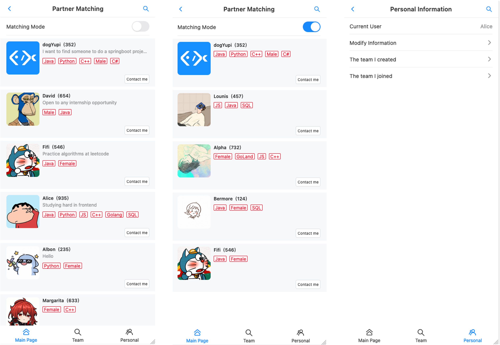
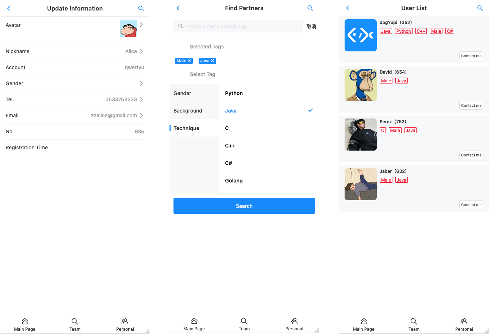
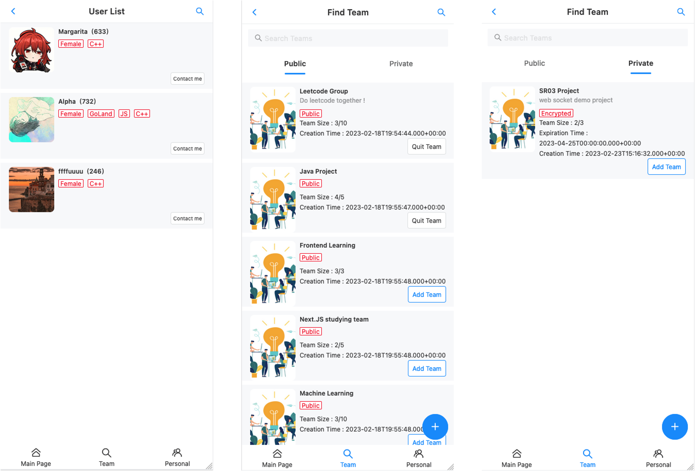
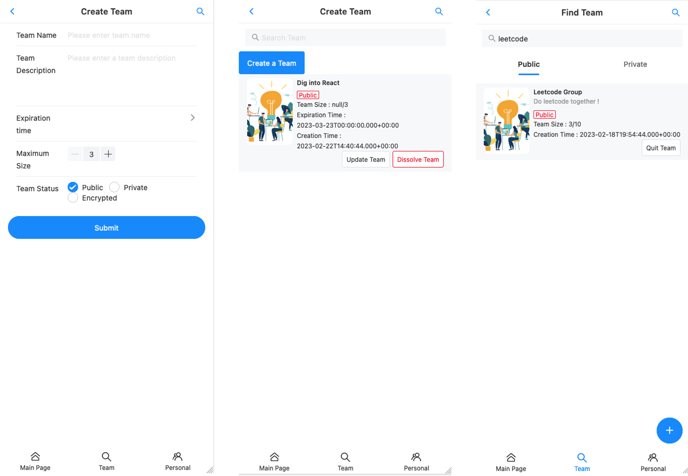

# A mobile platform that provides learning resources and partner matching for computer science students

## Tech Stack

### Frontend

- 🌲Vue3 - Progressive frameworks for building web
- 📱Vant UI - Mobile Web Component Library
- 🪜Vite - Front-end scaffolding
- 🔗Axios - Promise-based HTTP Client for the browser
- ⚒️Typescript - Type-safety for your code
- 🧾Html - Build your web page
- 📈CSS - Beautify your web style

### Backend

- 8️⃣Java - Optimize code with java8 features
- 🍃SpringBoot 2.7 - Quickly build applications
- 💿MySQL - Powerful relational database
- 🦅MyBatis - Excellent persistence layer framework
- 🕊️MyBatis X - Generate configuration plugin
- 💻Redis - key-value storage system
- 🔑Redisson - Distributed Locks
- 🧭Spring Scheduler - Execute timed tasks
- 📑Swagger + Knife4j - Organize interface documentation
- 🚄Gson - Json serialization tool
- 💡Recommendation Algorithm - Levenshtein distance algorithm

## Introduction

This is a mobile site based on Vue3 + SpringBoot2, which is a learning platform. It is a learning platform for computer science students. When registering, users can choose their own tags, such as the programming language they are good at and the technology they like, and our platform provides corresponding functions such as user management, searching users by tags, recommending similar users, and forming teams. We also collect programming learning resources and display them on the platform to provide free learning resources for students who want to learn skills in a particular area. 

Our vision is that through this platform, users can find their partners with the same skills and preferences, and exchange contact information and form teams to learn and communicate together. Users can also find the learning resources they need to study.

Back-end repository: https://github.com/Szzx123/Friend-Match-Backend

Front-end repository: https://github.com/Szzx123/Friend-Match-Frontend

### Project Technical Points

- When developing the front-end, we used the Vant UI component library and encapsulated the global common Layout component to make the layout of different pages consistent and reduce duplicate code.
- Based on Vue Router global routing guard to achieve a dynamic switching of navigation bar title according to different pages, and reduce the code of `if` condition judgment by extending the title field in the global routing configuration file.
- For collection processing operations in the project , we used the Java 8 Stream API and Lambda expressions to simplify the code.
- For the user login part, we used Redis to implement the distributed session, which solves the problem of synchronizing login status between clusters.
- Using Redis to cache the list of user information accessed at high frequencies to shorten the response time of the interface.
- To solve the problem of slow loading of user home pages on first time access to the system, Spring Scheduler timed tasks are used to warm up the cache and distributed locks are used to ensure that the timed tasks are not repeated when the cluster is deployed.
- To solve the problems of the same user repeatedly joining the queue and the number of people joining the queue exceeding the upper limit, we use Redisson distributed locks to implement operational mutual exclusion and ensure the idempotence of the interface.
- We used the recommendation algorithm  - Levenshtein distance algorithm, to recommend partners as well as learning resources based on the most matching tags.
- We use Swagger + Knife4j to automatically generate back-end interface documentation to avoid the hassle of manual documentation and facilitate direct debugging by developers.

### Interface Overview

**Main Page - User Matching Page - Personal Information Page**

**User information modification page - Search user page - User search result page**

**User search result page - Team Information Page**

**Create team page - Team management page - Search for team page**

## TODO List

- [x] Front-end page layout development
- [x] Database design
- [x] Back-end project initialization
- [x] Develop interface to search for users by tags
- [x] Front-end routing integration
- [x] Search user page development
- [x] User information page development
- [x] User information modification page development
- [x] Integrating Interface Documentation with Swagger
- [x] User search page integration with back-end interface
- [x] Resolving cross-domain issues
- [x] Transforming the back end into a distributed login
- [x] Develop user login function
- [x] Integration of front-end list components, component abstraction
- [x] Cache warm-up function implementation
- [x] Add timed tasks to implement preload cache
- [x] Adding distributed locks to resolve thread resource conflicts
- [x] Develop the function for users to make groups
- [x] Development of join team function
- [x] Development of modifying team functions
- [x] Develop the quit team function
- [x] Improve user permissions for operating teams
- [x] Develop user matching function
- [x] Optimize front-end design and introduce skeleton screen
- [x] Solve the problem that users repeatedly join the queue when concurrent
- [ ] Designing a database for storing course resources
- [ ] Develop front-end pages to showcase courses
- [ ] Transferring the algorithm of recommendation partners to recommend learning resources
- [ ] Develop the posting function in the group
- [ ] Develop the function to select labels for users during registration
